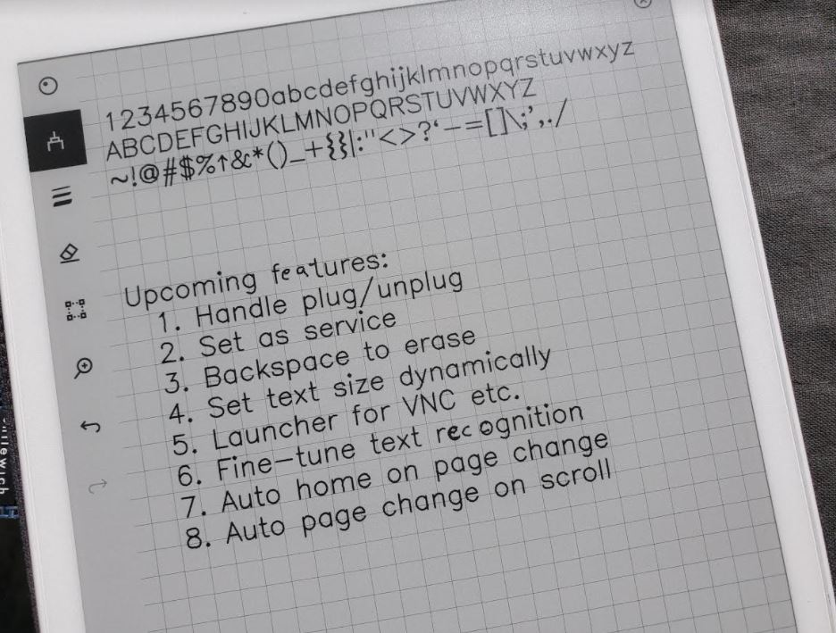

# Crazy Cow: Typewriter-ish input for reMarkable
*ej's Secret Plan #425*

## What's this?
It's a tiny (40k!) extension which turns keyboard input into text, drawn onto the screen **in the existing reMarkable environment** by mimicking stylus motion.

*(Most of these features got done, yay. Notice the hand-corrected letters, the text recognotion works on that too!)*

## What's this not?
- It's not fancy.
- It's not a text editor.
- It's not a code editor.
- It's not been tested on the reMarkable2.

## What's Crazy Cow?
The best sugar cereal from General Mills in the 1970's which had two superpowers:
1. Turn normal milk into chocolate milk.
2. Contain a codewheel which allows the user to emboss letters onto normal paper, using an optional letter-shift cypher.

## Why make this?
I use my reMarkable tablet every day, for work and for personal stuff. I've spent hundreds of early mornings with just coffee and the stylus, figuring out things that are important to me. Sometimes I want to type things, such as stories, without giving up the ink. I tried using (and adapting from others) custom apps which edit text, markdown, etc., but I actually like the existing reMarkable UI, and I want to work within it. For me, this is the right balance. No launcher to maintain, no little gotchas.

## What's good about ink?
1. **Color** - Yellow light from an RGB display does not contain any yellow light, just red and green. Even in 'night mode' which looks yellowish, there's no actual yellow light. Yellow light from the sun, reflected off of an ink display is actual yellow light. You may not think you notice the difference, but I think we all do. Also, just ask Clark Kent.
2. **Strobe** - Most digital displays strobe and flicker at a very high rate. Ink displays don't do this.
3. **Speed** - Ink displays are slow. I see this as a good thing.

## Installation instructions
1. copy **crazy-cow.service** to **/etc/systemd/system/**
2. copy **crazy-cow** to **/home/root/**
3. `ssh` to the tablet
4. `systemctl start crazy-cow`
5. `systemctl enable crazy-cow` (to enable on boot)

## User's Manual
Just plug in a keyboard and start typing! Seriously, that's it.

- It will use whatever marker tool you've got selected.
- The reMarkable's built-in text recognition works well on things you type.
- You can use the stylus to erase, correct, highlight, whatever.
- Use **ctrl key with `+`, `-`, `0`** to adjust the lettering size.
- Use **left/right arrows** to turn the page.
- **Some spiffy half-baked features:**
    - The **backspace key** does very limited backspacing, by tapping the "undo" tool.
    - It does **basic word-wrapping** by backspacing and re-typing. *(Yeah, I know, but it works.)*
    - Use **up/down arrows** to move the cursor up/down.

## Where's the cursor?
There is no visible cursor. Do not panic. Real typewriters don't have one either. If you type something in the wrong place, just `backspace`, or tap undo, or erase it with the stylus. Then (like a real typewriter) use `space`, `up`, `down`, `enter` to get to the right place.

## If you find a bug
Please post an issue. This is a just-for-fun project for me.
